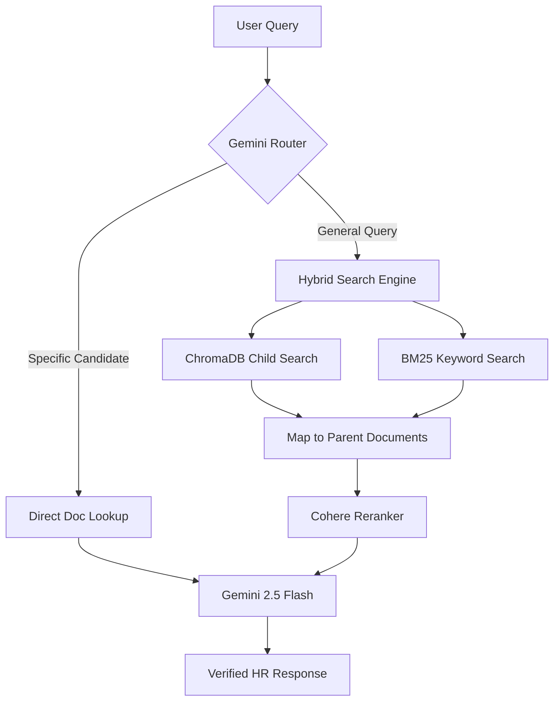

# 🤖 TalentIQ: Agentic RAG Intelligence Suite

[](https://www.python.org/)
[](https://streamlit.io/)
[](https://ai.google.dev/)
[](https://www.langchain.com/)

**TalentIQ** is an enterprise-grade Résumé Intelligence platform that transforms static PDF resumes into a dynamic, queryable knowledge base. Built for senior AI/ML engineering roles, it employs **Agentic RAG (Retrieval-Augmented Generation)** to provide high-precision answers about candidate experience, skill gaps, and role suitability.

---

## 🚀 Key Features

*   **🧠 Intelligence-Driven Query Routing**: Automatically classifies questions with **Gemini 2.5 Flash** to decide between "Direct Full-CV Lookup" (for timeline/gap analysis) or "Hybrid Fragment Search" (for general queries).
*   **📂 Advanced Parent-Child Chunking**: Combines high-precision **Child Chunks (300 chars)** for retrieval with rich **Parent Chunks (2000 chars)** for LLM context.
*   **🔍 Hybrid Search Engine**: Fuses **ChromaDB Semantic Search** (Vector) with **BM25 Keyword Search** (Lexical) using a **75/25 weight ratio**.
*   **🎯 Cohere AI Reranking**: Utilizes `rerank-english-v3.0` to filter the top retrieved chunks, ensuring the LLM only reads the most hyper-relevant data.
*   **📄 Premium Parsing**: Uses **LlamaParse (Markdown-mode)** to intelligently extract tables and layout structures from complex PDF resumes.
*   **📊 Enterprise Dashboard**: A professional, light-themed Streamlit UI featuring metric cards, document viewers, and real-time pipeline timing breakdowns.

---

## 🛠️ Tech Stack

- **Core**: Python 3.11, LangChain
- **LLM/Embeddings**: Google Gemini 2.5 Flash, Gemini-Embedding-001
- **Database**: ChromaDB (Vector), Local JSON Store (Parent Documents)
- **Reranker**: Cohere AI
- **Parsing**: LlamaParse
- **UI**: Streamlit

---

## 📐 Architecture Overview



---

## ⚙️ Installation & Setup

### 1. Clone the repository
```bash
git clone https://github.com/yourusername/talentiq-agentic-rag.git
cd talentiq-agentic-rag
```

### 2. Set up Environment
```bash
python -m venv .venv
source .venv/bin/activate  # On Windows: .venv\Scripts\activate
pip install -r requirements.txt
```

### 3. Configure API Keys
Create a `.env` file in the root directory:
```env
GOOGLE_API_KEY="your_google_key"
LLAMA_CLOUD_API_KEY="your_llama_key"
COHERE_API_KEY="your_cohere_key"
```

### 4. Run the Pipeline
```bash
python Parsing.py     # Convert PDFs to Markdown
python Embeddings.py  # Build the Parent-Child Database
streamlit run visualizer.py
```

---

## 🛡️ License
MIT License.

---
*Created with ❤️ by [Your Name]*
